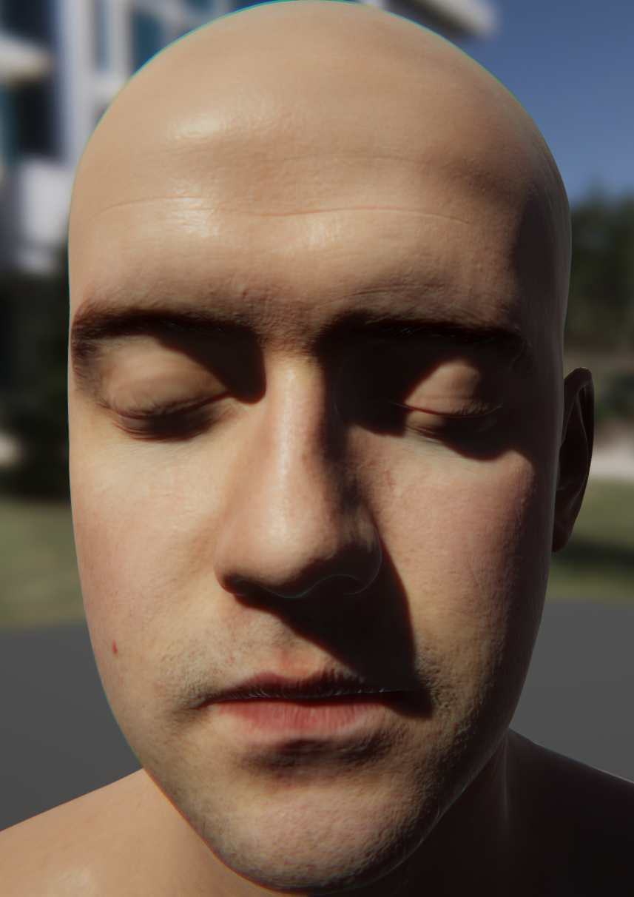
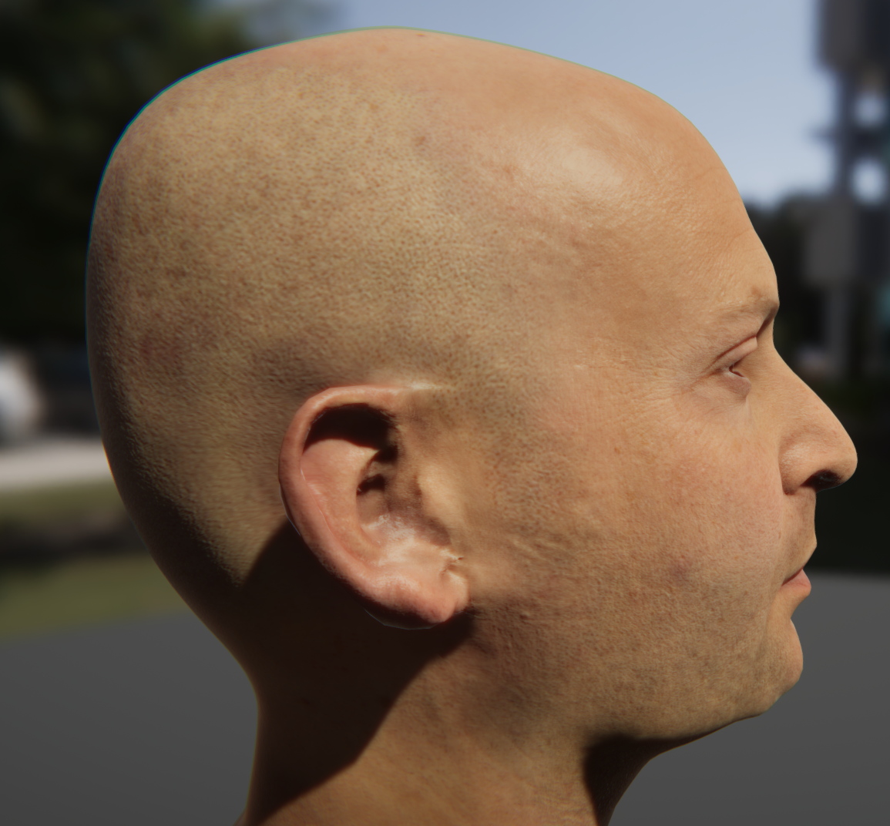

# Unity Subsurface Scattering Skin
## Features:
* Realtime Post-processing SSS effects(Screen Space SSS)
* Custom Shader supported(Stencil based post-processing)
* Realtime color gradient calculations
## Guide:
* Add "SeparableSubsurfaceScatter.cs" to the rendering camera and transform the options provided.
* Add a custom shader material to your human skin renderer.
* The custom shader should have a Stencil marked with "Ref 5", the post-processing component will use this mark.
* Make sure the material's render queue is larger than any other material, for instance alphaTest or 2499 are suggested as queue.
* Currently the effects only support forward rendering path.

## FAQ:
### What shader should I use during making my own character?
* You should use a shader with a Stencil{Ref 5...} in forward opaque pipeline to make sure that the post-processing component will use that mask.
* Then, we suggest that you should use standard specular lighting shader for your skin, in our experiment, the shader with Unity GGX specular looks better than the others.
### Why forward rendering path only?
* Currently, we are seeking for a better solution to use both custom lighting model and deferred shading, which is difficult because the GBuffers' data is limited. Even if we use scriptable rendering pipeline, GBuffer textures is still inefficient especially for high resolution screen. Also, some effects such as transmission, can only be used during forward pipeline.
### Can I make more improvement based on SSSSS?
* Of course you can, we are currently using Disney diffuse and GGX specular for direct light calculation, obviously it is not the best solution for human's skin rendering. You can definitely try some more lighting formula and compare them, the post-processing component is compatible.

## Comming Soon:
* Screen Space SSS for deferred shading rendering path (more efficiency, more effects supported).
* Provide more High definition skin shaders with exciting features.

